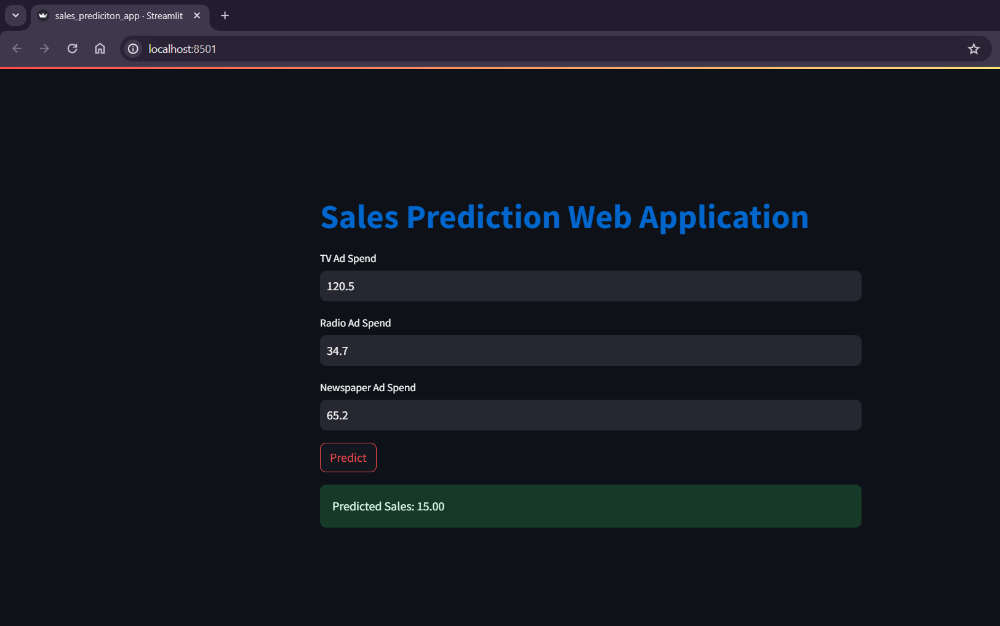

# Advertising Sales Prediction

### Introduction
The goal of this project is to develop predictive models for advertising sales based on different marketing channels such as TV, Radio, and Newspaper. The project involves data exploration, visualization, and building two regression models: Linear Regression and XGBoost. The predictive performance of these models is evaluated, and the better-performing model is saved for future use.

### Code Overview

#### 1. Data Exploration and Cleaning
- **Importing Libraries:** The project starts by importing essential libraries such as NumPy, Pandas, Matplotlib, Seaborn, and Plotly Express.

- **Loading the Dataset:** The advertising dataset is loaded from a CSV file using Pandas.

- **Data Inspection and Cleaning:** Basic exploratory data analysis (EDA) is performed to understand the structure of the dataset. The absence of missing values is confirmed, and boxplots are used to identify outliers in the features (TV, Radio, Newspaper).

#### 2. Exploratory Data Analysis (EDA)
- **Univariate Analysis:** Histograms and violin plots are created to analyze the distribution of the target variable (Sales). Pair plots and a heatmap are generated to visualize relationships and correlations between different variables.

- **Correlation Analysis:** The correlation heatmap highlights the correlation between variables, helping identify influential features.

#### 3. Linear Regression
- **Regression Plots:** Simple linear regression plots are created for each marketing channel (TV, Radio, Newspaper) against Sales using Plotly Express.

- **Model Building:** Linear regression analysis is performed using the `statsmodels` library. The relationship between TV ad spend and Sales is emphasized, and key statistics are analyzed.

- **Model Evaluation:** Residual analysis is conducted to validate assumptions, and predictions on the test set are evaluated using metrics such as Mean Squared Error (MSE) and R-squared.

#### 4. XGBoost Regression
- **GridSearchCV:** Hyperparameter tuning is performed using GridSearchCV to find the best parameters for the XGBoost model.

- **Model Building and Evaluation:** The XGBoost model is trained and evaluated using MSE and R-squared. A comparison is made with the Linear Regression model.

#### 5. Model Comparison and Conclusion
- **Model Comparison:** The MSE and R-squared scores of both models are compared. XGBoost is identified as the superior model in terms of prediction accuracy and explanatory power.

- **Conclusion:** The project concludes by summarizing the key findings and insights from both regression models.

#### 6. Model Saving
- **Saving the Model:** The trained XGBoost model is saved using the Pickle library for future use.
---
# **Project Report**
#### Linear Regression vs. XGBoost
- In comparing the two models, XGBoost outperforms Linear Regression in terms of both prediction accuracy and explanatory power. The XGBoost model has a lower Mean Squared Error (1.15) and a higher R-squared score (0.94) compared to Linear Regression (MSE: 2.01, R2 Score: 0.75).

#### Conclusion and Recommendations
- Based on the evaluation metrics, XGBoost is recommended for predicting advertising sales. It provides better accuracy in predictions and explains a higher proportion of the variance in the data. The insights obtained from this analysis can be valuable for optimizing marketing strategies and budget allocation.

#### Future Work
- Future work could involve exploring more advanced machine learning techniques, feature engineering, and incorporating additional features for a more comprehensive analysis.

### Acknowledgments:-
This project was developed by [Your Name] as part of [Your Organization]'s data science initiative. The dataset used is from [Source], and the project code is available on [GitHub Repository Link].

---

### NOTE:- Before running the jupyter notebook please ensure that you have the necessary libraries installed. 

```pip install -r requirements.txt```

## Running the Application

1. **Download the Code:**
   - Download the provided Python script (`sales_prediction_app.py`) to your local machine.

2. **Download the Pre-trained Model:**
   - Make sure you have the pre-trained XGBoost model file (`xgb_model.pkl`) available. If you don't have it, you can train the model using the provided code and save it using Pickle.

3. **Navigate to the Script Directory:**
   - Open a terminal or command prompt and navigate to the directory where the `sales_prediction_app.py` script is located.

4. **Run the Streamlit App:**
   - Execute the following command to run the Streamlit application:

     ```bash
     streamlit run sales_prediction_app.py
     ```

5. **Access the Application:**
   - After running the command, Streamlit will provide a link (usually `localhost:8501`) in the terminal. Open your web browser and go to that link.

6. **Use the Application:**
   - The application will open in your web browser. Enter numerical values for TV, Radio, and Newspaper ad spends in the respective text input fields.

   - Click the "Predict" button to see the predicted sales based on the entered values.

   

   - Note: If you don't have valid numerical inputs, the application will display an error message.

7. **Close the Application:**
   - Close the web browser window when you are done using the application.

---
## Customization

- **Model Replacement:**
  - If you have a different pre-trained model, replace the `xgb_model.pkl` file with your model file.

- **Styling and Customization:**
  - You can customize the styling of the application by modifying the CSS code in the `sales_prediction_app.py` script.

- **Further Development:**
  - Feel free to extend the functionality or add additional features to the Streamlit application based on your requirements.

**Note:** The application uses Streamlit's default web server, which is suitable for development purposes. For production deployment, consider using a production-ready server.

---
